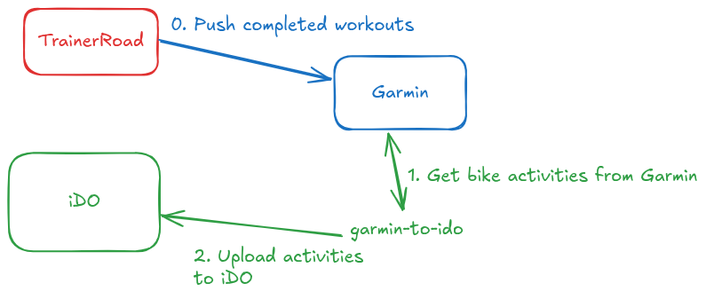

# garmin-to-ido

A Golang CLI tool to synchronize bike activities from Garmin Connect to iDO Sport.

TL;DR

When I moved to iDO with my coach, my completed activities done on TrainerRoad wouldn't be uploaded to iDO. That's because TrainerRoad would push the completed workout to Garmin, but Garmin wouldn't forward it to iDO (because it's not a garmin activity directly). So I just added some glue to get it done automatically (i.e. get the activity from Garmin and upload it to iDO).



## Features

- Sync bike activities from Garmin Connect to iDO Sport
- By default, syncs today's activities
- Specify a custom date to sync
- Uses Garmin Connect API with username/password authentication
- Uses browser automation (chromedp) for iDO Sport (no official API available)

## Prerequisites

- Python 3.x with `garminconnect` package
- Chrome/Chromium browser (for headless browser automation)

## Installation

### Option 1: Download Pre-built Binary (Recommended)

1. Go to the [Releases page](https://github.com/YOUR_USERNAME/garmin-to-ido/releases)
2. Download the binary for your platform:
   - **Linux (64-bit)**: `garmin-to-ido-linux-amd64`
   - **Linux (ARM64)**: `garmin-to-ido-linux-arm64`
   - **macOS (Intel)**: `garmin-to-ido-darwin-amd64`
   - **macOS (Apple Silicon)**: `garmin-to-ido-darwin-arm64`
   - **Windows (64-bit)**: `garmin-to-ido-windows-amd64.exe`

3. Make the binary executable (Linux/macOS only):
```bash
chmod +x garmin-to-ido-*
```

4. Install Python dependencies:
```bash
pip install garminconnect
```

5. Move the binary to a location in your PATH (optional):
```bash
# Linux/macOS
sudo mv garmin-to-ido-* /usr/local/bin/garmin-to-ido

# Or keep it in your current directory and run with ./garmin-to-ido
```

### Option 2: Build from Source

1. Clone the repository:
```bash
git clone <repository-url>
cd garmin-to-ido
```

2. Install Python dependencies:
```bash
pip install garminconnect
```

3. Install Go dependencies:
```bash
go mod download
```

4. Build the application:
```bash
go build -o garmin-to-ido
```

## Configuration

1. Copy the example configuration file:
```bash
cp .env.example .env
```

2. Edit `.env` and add your credentials:
```
GARMIN_USERNAME=your-garmin-email@example.com
GARMIN_PASSWORD=your-garmin-password
IDO_USERNAME=your-ido-email@example.com
IDO_PASSWORD=your-ido-password
```

**Note:** Keep your `.env` file secure and never commit it to version control.

## Usage

### Sync today and yesterday (default behavior)
```bash
./garmin-to-ido
```

### Sync a specific date
```bash
./garmin-to-ido -date 2025-01-15
```

### Use a custom config file
```bash
./garmin-to-ido -config /path/to/config.env
```

### All options
```bash
./garmin-to-ido -h
```

## Project Structure

```
garmin-to-ido/
├── main.go                      # Entry point and CLI parsing
├── internal/
│   ├── config/
│   │   └── config.go           # Configuration management
│   ├── garmin/
│   │   └── client.go           # Garmin Connect API client
│   ├── ido/
│   │   └── client.go           # iDO Sport browser automation
│   └── sync/
│       └── syncer.go           # Synchronization logic
├── .env                         # Configuration file (not in git)
├── .env.example                 # Example configuration
└── README.md
```

## TODO / Known Issues

- **iDO Sport upload implementation is incomplete**: The `internal/ido/client.go` file contains a placeholder for the upload functionality. You need to:
  1. Inspect the iDO Sport website to understand their upload mechanism
  2. Implement the actual upload logic using chromedp
  3. Handle file uploads (GPX format from Garmin)
  4. Add error handling for upload failures

## Development

### Run without building
```bash
go run main.go
```

### Run tests
```bash
go test ./...
```

### Build for different platforms
```bash
# Linux
GOOS=linux GOARCH=amd64 go build -o garmin-to-ido-linux

# macOS
GOOS=darwin GOARCH=amd64 go build -o garmin-to-ido-macos

# Windows
GOOS=windows GOARCH=amd64 go build -o garmin-to-ido.exe
```

## How it works

1. **Authentication**:
   - Logs into Garmin Connect using official API endpoints
   - Logs into iDO Sport using browser automation

2. **Activity Retrieval**:
   - Fetches activities from Garmin for the specified date(s)
   - Filters for cycling/bike activities only

3. **Synchronization**:
   - Downloads each activity in GPX format
   - Uploads to iDO Sport via browser automation

## Contributing

Contributions are welcome! Please feel free to submit a Pull Request.

## License

See LICENSE file for details.
